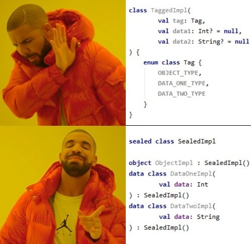

# Performance test for Kotlin sealed classes

This repository has code for benchmark performance of sealed classes in `when` branches. Main idea in [this habr article](https://habr.com/ru/post/430014/).

Thanks for [Igor Manushin](https://github.com/imanushin/) and his [article about benchmarking](https://habr.com/ru/post/349914/)
